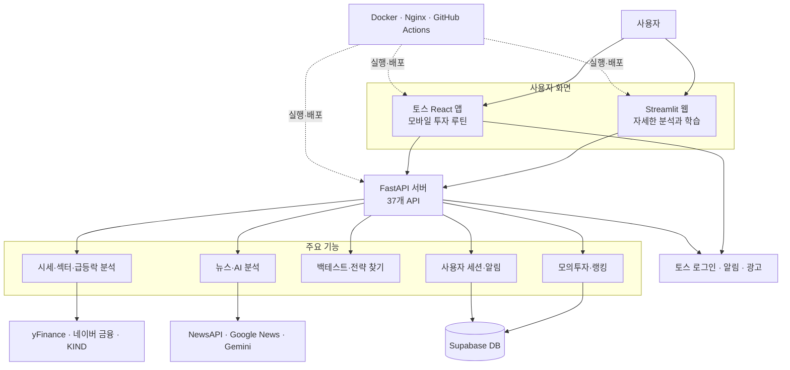
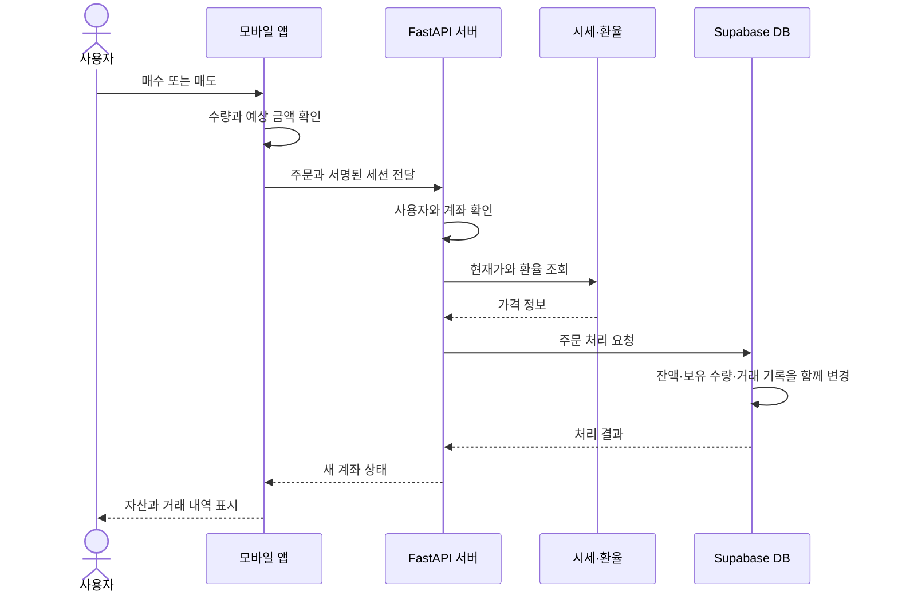

# 한눈투자 (Glance Invest)

> 시장을 살펴보고, 투자 전략을 검증하고, 실제 돈 없이 주식투자를 연습하는 서비스

---

## 1. 프로젝트 요약

| 항목 | 내용                                                             |
| --- |----------------------------------------------------------------|
| 개발 기간 | `2026.06.18 ~ 진행 중`                                            |
| 담당 범위 | 기획, 백엔드, 웹·모바일 화면, 데이터베이스, 외부 서비스 연동, 실행 환경 구성                 |
| 서비스 구성 | Streamlit 웹 + 토스 React 앱 + FastAPI 서버 + Supabase DB            |
| 주요 기술 | Python, FastAPI, Pandas, React, TypeScript, PostgreSQL, Docker |
| 구현 범위 | 화면 2종, API 37개, 투자 전략 3개, 국내·미국주식 지원                           |
| 사용자 현황 | `2026-08-19`기준 DAU 181명                                        |
| 최근 검증 | 자동 테스트 29건 통과, Apps in Toss 운영 빌드 성공                           |

한눈투자는 투자 입문자가 아래 과정을 한 서비스에서 이어서 경험하도록 만든 프로젝트입니다.

```text
시장·급등락 확인 → 뉴스 확인 → 종목 위험 확인 → 전략 검증 → 모의투자
```

처음에는 이동평균 전략을 시험하는 간단한 웹 도구였습니다. 이후 국내·미국주식, AI 뉴스 분석, 종가베팅 점수, 모의투자, 랭킹, 토스 알림과 광고를 추가했습니다. 최근에는 국내·미국 급등락 종목 탐색과 SK하이닉스 추가매수 판단을 더하고, 외부 시세 제한이나 서버 콜드 스타트에도 최근 정상 데이터를 먼저 보여준 뒤 최신값으로 자동 교체하도록 운영 안정성을 보강했습니다.

### 이 프로젝트에서 보여주고 싶은 역량

- 하나의 FastAPI 서버를 웹과 모바일 앱이 함께 사용하도록 설계했습니다.
- 외부 시세나 뉴스 서비스가 실패해도 앱이 최대한 계속 동작하도록 만들었습니다.
- 백테스트 결과가 과장되지 않도록 주문 시점을 실제와 가깝게 처리했습니다.
- 모의주문의 잔액, 보유 종목, 거래 기록이 서로 어긋나지 않도록 DB에서 한 번에 처리했습니다.
- 사용자의 보유 정보는 저장하지 않으면서 가격·추세·뉴스·종목 비중을 함께 계산하도록 구현했습니다.
- 실제 로딩 시간을 측정하고 느린 구간과 개선 순서를 정리했습니다.

### 최근 업데이트

| 날짜 | 업데이트 | 구현 내용 |
| --- | --- | --- |
| `2026-08-12` | SK하이닉스 추가매수 판단 | 평단가·보유 수량·추가 예산·계좌 비중과 최신 시세, 이동평균, RSI, 뉴스를 함께 계산 |
| `2026-08-14` | SK hynix ADR 지원 | KOSPI `000660`과 NASDAQ `SKHY` 시세를 함께 표시하고 AI 분석·전략 연습·모의투자 선택 목록에 연결 |
| `2026-08-14` | 국내·미국 급등락 종목 | 홈과 시장 화면에서 상승·하락 순위를 제공하고 선택한 종목의 AI 분석으로 바로 이동 |
| `2026-08-19` | 시세 요청 제한 대응 | 국내 급등락 조회를 네이버 KOSPI·KOSDAQ 순위 데이터로 분리하고, 성공 결과 캐시·이전 정상값·실패 쿨다운으로 반복 503을 줄임 |
| `2026-08-19` | 모의투자 랭킹 안정화 | 랭킹 시세·환율 캐시와 장애 상태 표시를 추가하고 화면이 보이는 동안 1분마다 순위를 자동 갱신 |
| `2026-08-19` | 미국 기술주 확대 | AI·반도체·소프트웨어·사이버보안 중심 18개 종목을 추가해 공통 선택 목록을 25개로 확장 |
| `2026-08-20` | 콜드 스타트·503 대응 | 최근 급등락 스냅샷을 서버와 기기에 저장해 먼저 표시하고, 백그라운드 단일 갱신과 10초 화면 확인으로 최신값을 자동 교체 |

---

## 2. 실제 화면

아래 화면은 `2026-08-11` 코드를 Docker로 실행한 뒤 Chrome 모바일 화면 크기 `430 × 932`로 직접 캡처했습니다. 이후 추가된 급등락 종목, SK하이닉스 투자 체크, 랭킹 자동 갱신, 콜드 스타트 투자 체크 카드는 위 최근 업데이트와 6절에 별도로 정리했습니다.

<table>
  <thead>
    <tr>
      <th width="33%">홈</th>
      <th width="33%">모의투자</th>
      <th width="33%">시장 분석</th>
    </tr>
  </thead>
  <tbody>
    <tr>
      <td></td>
      <td></td>
      <td></td>
    </tr>
    <tr>
      <td>3분 투자 루틴과 출석 보상</td>
      <td>자산 확인과 국내·미국주식 주문</td>
      <td>강한 섹터와 약한 섹터 비교</td>
    </tr>
  </tbody>
</table>

---

## 3. 만들게 된 이유

투자 입문자는 시장 흐름, 종목 뉴스, 투자 전략, 주문 연습을 서로 다른 서비스에서 확인해야 합니다. 정보는 많지만 무엇부터 봐야 하는지 알기 어렵습니다.

한눈투자는 사용자가 다음 순서로 판단하도록 돕습니다.

1. 오늘 강한 시장과 섹터를 확인합니다.
2. 관심 종목의 뉴스와 분위기를 확인합니다.
3. 상승 가능성뿐 아니라 위험 신호도 함께 확인합니다.
4. 과거 주가로 투자 전략을 시험합니다.
5. 실제 돈 없이 주문과 자산 관리를 연습합니다.

수익률만 강조하지 않고 손실 위험, 데이터 기준일, 분석의 한계도 함께 보여주는 것을 원칙으로 삼았습니다.

---

## 4. 전체 구조

웹과 토스 앱은 같은 FastAPI 서버를 사용합니다. 공통 시세·뉴스·전략 계산은 서버가 담당하고, 추가매수 판단처럼 사용자가 직접 입력한 보유 정보가 필요한 계산은 토스 앱 안에서 처리합니다. 두 화면은 사용 환경에 맞게 따로 만들었습니다.



### 폴더별 역할

- [`backend/`](./backend): 시세 수집, 뉴스 분석, 백테스트, 모의투자, 세션, 알림
- [`frontend/`](./frontend): 넓은 화면에서 자세히 보는 Streamlit 웹
- [`toss-inapp/`](./toss-inapp): 모바일 사용 흐름에 맞춘 React 앱
- [`backend/supabase_paper_trading.sql`](./backend/supabase_paper_trading.sql): 계좌, 보유 종목, 거래 기록, 알림 DB 구조
- [`docker-compose.yml`](./docker-compose.yml): 서버와 두 화면을 한 번에 실행하는 설정

---

## 5. 주요 기능

| 기능 | 사용자에게 제공하는 내용 |
| --- | --- |
| 시장 분석 | 국내 7개 섹터와 미국 대표 섹터 ETF 11개의 단기·중기 흐름 비교 |
| 급등락 종목 | 국내·미국 시장의 최근 거래일 상승·하락 순위, 기기·서버의 이전 정상값 즉시 표시, 백그라운드 자동 갱신, AI 분석 바로가기 |
| AI 뉴스 분석 | 중복 뉴스를 정리하고 긍정·중립·부정 분류, 요약, 판단 근거 제공 |
| 종가베팅 연습 | 가격, 거래량, 섹터, 뉴스 등 7개 항목으로 점수와 위험 신호 제공 |
| SK하이닉스 투자 체크 | 국내주식·ADR 시세 비교와 보유 조건별 추가매수 점수·예상 평단·비중 제공 |
| 전략 시험 | 이동평균, RSI, 볼린저 밴드 전략을 과거 주가로 검증 |
| 전략 찾기 | 여러 조건을 모두 비교해 가장 나았던 조건 조합 확인 |
| 모의투자 | 국내·미국주식 매수·매도, 자산과 수익률 확인, 1분 자동 갱신 익명 랭킹 제공 |
| 투자 루틴 | 시장 → 관심 종목 → 오늘 후보의 3단계 루틴과 최근 7일 기록 |
| 토스 기능 | 사용자 연결, 스마트 알림, 광고, 친구 공유 보상 |

---

## 6. 문제를 해결한 방법

### 6.1 시세 서비스가 실패해도 다시 시도합니다

#### 문제

국내 종목코드 `005930`은 데이터 제공처에 따라 `005930.KS` 또는 `005930.KQ`로 요청해야 합니다. 또한 Yahoo Finance의 요청 제한이나 상장사 목록 다운로드 실패로 화면이 멈출 수 있었습니다.

#### 해결

- 종목코드에 코스피·코스닥 형식을 붙여 순서대로 확인합니다.
- 첫 번째 시세 조회가 실패하면 다른 조회 방식으로 다시 요청합니다.
- 정상적으로 받은 시세와 상장사 목록을 파일에 저장합니다.
- 외부 서비스가 잠시 실패하면 마지막으로 저장한 데이터를 사용합니다.
- 국내 현재가는 네이버 금융을 먼저 사용하고, 실패하면 yFinance 최근 종가를 사용합니다.
- 랭킹 시세는 30초 동안 공유하고, 새 조회가 실패하면 최대 15분 이내의 최근 정상 시세를 사용합니다.
- 미국주식 랭킹 환율은 5분 동안 공유하고, 제공처 장애 시 최근 정상 환율임을 구분합니다.

#### 결과

외부 서비스 하나가 실패해도 종목 검색과 시세 조회가 바로 중단되지 않습니다. 저장된 데이터도 없을 때는 사용자가 다시 시도할 수 있도록 일시적인 오류라고 안내하고, 같은 실패 요청을 짧은 시간에 반복하지 않습니다.

### 6.2 백테스트에서 미래 가격을 미리 사용하지 않습니다

#### 문제

오늘 종가로 만든 매수 신호를 오늘 가격에 바로 체결하면 실제로 알 수 없었던 미래 정보를 사용하게 됩니다. 이렇게 계산하면 결과가 실제보다 좋아질 수 있습니다.

#### 해결

- 오늘 신호가 생기면 **다음 거래일 시가**에 주문합니다.
- 같은 기간의 단순 보유 결과와 전략 결과를 함께 보여줍니다.
- 전액 매수와 정해진 금액만 매수하는 방식을 모두 지원합니다.
- 총수익률뿐 아니라 최대 하락폭(MDD), 변동성, 승률, 손익 비율도 계산합니다.
- 여러 조건을 모두 실행해 가장 나았던 조합을 찾습니다.

#### 결과

단순히 수익률이 높은 전략이 아니라, 어떤 주문 기준과 위험을 가진 결과인지 함께 비교할 수 있습니다. 다만 현재는 세금, 수수료, 주문 가격 차이를 반영하지 않아 학습용으로만 사용합니다.

### 6.3 모의주문 기록이 일부만 저장되지 않도록 했습니다

#### 문제

매수할 때 예수금만 줄고 보유 수량이 늘지 않거나, 거래 기록만 빠지면 계좌 정보가 맞지 않게 됩니다. 사용자가 보낸 계좌 번호를 그대로 믿는 것도 안전하지 않습니다.

#### 해결

- 서버가 계좌 번호와 위조 확인용 서명을 함께 발급합니다.
- 토스 사용자 키는 원문을 저장하지 않고 알아볼 수 없는 값으로 바꿉니다.
- 주문 시 예수금, 보유 수량, 평균 가격, 거래 기록을 DB에서 한 번에 처리합니다.
- 미국주식은 주문 시점의 원·달러 환율로 원화 금액을 계산합니다.
- 실제 계좌 번호는 랭킹에 공개하지 않고 자동 생성한 별명을 사용합니다.



#### 결과

주문의 일부만 저장되는 문제를 막고, 사용자의 계좌 정보가 다른 사용자에게 노출되지 않도록 했습니다.

### 6.4 AI가 실패해도 뉴스는 확인할 수 있습니다

#### 문제

같은 기사가 여러 번 검색되거나, 종목 이름 차이로 필요한 기사가 빠질 수 있습니다. AI 응답이 늦거나 잘못된 형식으로 오면 전체 화면이 실패할 수도 있습니다.

#### 해결

- 회사명, 종목코드, 한국어·영어 검색어를 조합해 뉴스를 찾습니다.
- 제목과 주소를 비교해 중복 기사를 제거합니다.
- AI가 정해진 형식으로만 답하도록 결과 구조를 고정했습니다.
- Gemini가 실패하면 단어 규칙으로 긍정·중립·부정을 분류합니다.
- 현재가와 뉴스는 동시에 요청해 빠른 현재가가 AI 분석을 기다리지 않게 했습니다.

#### 결과

AI를 매수·매도 결정 도구가 아니라 뉴스를 빠르게 정리하는 보조 도구로 사용합니다. 사용자는 요약뿐 아니라 기사 원문과 판단 근거도 함께 확인할 수 있습니다.

### 6.5 토스 기능이 실패해도 핵심 기능은 유지합니다

#### 문제

광고나 친구 공유 기능은 앱 버전, 테스트 환경, 광고 재고에 따라 실행되지 않을 수 있습니다.

#### 해결

- 광고를 사용할 수 없으면 광고 영역만 숨기고 분석 결과는 그대로 보여줍니다.
- 리워드 광고는 끝까지 본 이벤트가 확인된 경우에만 완료 처리합니다.
- 5일 연속 출석하면 광고 없는 AI 분석권 5개를 지급합니다.
- 분석이 실패하면 사용한 분석권을 자동으로 돌려줍니다.

#### 현재 한계

출석 기록과 분석권은 현재 기기에만 저장됩니다. 여러 기기에서 사용하거나 부정 사용을 막으려면 서버 저장 방식으로 바꿔야 합니다.

### 6.6 급등락 종목의 기준 시점을 함께 보여줍니다

#### 문제

급등주·급락주 순위만 보여주면 사용자가 장중 변동값을 확정된 등락률로 오해할 수 있습니다. 국내와 미국 시장은 거래 시간과 종목 범위도 달라 같은 기준으로 단순 비교하기 어렵습니다.

#### 해결

- 미국은 Yahoo Finance의 NASDAQ·NYSE 급등락 종목 중 주가 5달러·시가총액 20억달러 이상을 조회합니다.
- 국내는 Yahoo screener와 분리해 네이버 KOSPI·KOSDAQ 상승·하락 순위를 합치고, 시가총액 1천억원·거래량 1만주 이상만 남깁니다.
- 장중에는 잠정치, 장 마감 뒤에는 최근 거래일 확정값이라고 표시합니다.
- 홈에서는 두 시장의 상·하위 3개씩, 상세 화면에서는 선택한 시장의 상·하위 10개씩 보여줍니다.
- 미국과 국내 데이터를 동시에 요청하되, 한 시장이 실패해도 정상 응답을 받은 시장은 유지합니다.
- 같은 조건의 성공 결과는 5분 동안 공유하고, 갱신 실패 시 최대 7일 이내의 직전 정상 결과를 `이전 데이터`로 표시합니다.
- 최근 성공 스냅샷을 서버 파일과 사용자 기기에 함께 저장해 서버 프로세스가 다시 시작돼도 재방문 사용자는 목록부터 확인할 수 있습니다.
- 이전 데이터를 반환한 요청은 응답을 막지 않고 백그라운드에서 갱신하며, 같은 캐시 키의 외부 호출은 하나만 실행합니다.
- 화면은 이전 데이터를 그대로 유지한 채 10초마다 새 결과를 확인하고, 정상 응답이 준비되면 목록을 최신값으로 교체합니다.
- 실패 뒤 1분 동안 제공처 재호출을 막아 화면의 자동 확인이 외부 API 요청 폭주로 이어지지 않게 했습니다.
- 종목을 선택하면 시장과 거래소 정보가 채워진 AI 뉴스 분석 화면으로 이동합니다.

#### 결과

사용자는 순위뿐 아니라 데이터 기준일, 장중 여부, 종목 범위, 이전 정상값과 자동 갱신 상태를 함께 확인할 수 있습니다. 국내 급등락은 실제 KOSPI·KOSDAQ 응답으로 상승·하락 각 3종목을 반환하는 스모크 테스트까지 확인했습니다.

### 6.7 추가매수를 계좌 위험과 함께 판단합니다

#### 문제

보유 종목의 가격이 내려갔다는 이유만으로 추가매수하면 하락 추세와 종목 집중 위험이 더 커질 수 있습니다. 현재가만으로는 매수 뒤 평단가와 계좌 비중이 어떻게 변하는지도 알기 어렵습니다.

#### 해결

- 사용자가 입력한 평단가, 보유 수량, 추가 예산, 현재 계좌 비중을 최신 SK하이닉스 시세와 결합합니다.
- 최근 120일 가격으로 20·60일 이동평균과 RSI(14)를 계산하고 당일 등락률과 뉴스 분위기를 함께 반영합니다.
- 기존 평가액 대비 추가 금액과 매수 뒤 종목 비중을 계산해 과도한 물타기와 집중 위험에 감점을 줍니다.
- 결과를 `추매 고려`, `소액 분할 접근`, `지금은 보류`로 나누고 예상 매수 수량·평단가·종목 비중을 보여줍니다.
- 급락, 과열, 하락 추세, 30~40%를 넘는 종목 비중에는 별도의 안전 조건을 안내합니다.
- 입력값과 계산 결과는 서버로 전송하거나 저장하지 않고 앱 안에서만 처리합니다.

#### 결과와 한계

가격이 싸 보이는지만 묻는 대신 추세와 계좌 집중도를 함께 확인하도록 사용 흐름을 바꿨습니다. 현재 규칙은 SK하이닉스에 한정한 학습용 휴리스틱이며, 실제 수익을 예측하거나 매수·매도를 권하는 모델은 아닙니다.

### 6.8 모의투자 랭킹을 최신 상태로 유지합니다

#### 문제

랭킹 API가 정상 응답하더라도 시세 제공처가 제한되면 일부 종목이 평균 매입가로 평가되어 순위가 갑자기 달라질 수 있었습니다. 또한 랭킹 화면을 계속 열어 두면 사용자가 새로고침하기 전까지 화면의 순위가 바뀌지 않았습니다.

#### 해결

- 랭킹 요청 때 참여 계좌와 보유 종목을 다시 집계하고 최신 시세로 순위를 계산합니다.
- 종목별 최근 정상 시세와 원·달러 환율을 공유해 사용자마다 같은 외부 요청을 반복하지 않습니다.
- 새 시세 조회가 실패하면 제한된 시간 안의 최근 정상값을 사용하고 `stale`, 정상 시세가 전혀 없으면 평균 매입가를 사용하고 `partial`로 구분합니다.
- 랭킹 화면과 홈 랭킹 카드는 화면이 보이는 동안 1분마다 자동으로 다시 조회합니다.
- 일부 종목이 최근 정상값이나 평균 매입가로 평가되면 계산 기준 시각과 함께 사용자에게 알립니다.

#### 결과

운영 환경에서 참여자 11명의 랭킹이 연속 요청 시각에 맞춰 다시 계산되는 것을 확인했습니다. 시세 제공처 장애가 곧바로 전체 랭킹 실패나 급격한 평균매입가 대체로 이어지는 가능성도 줄였습니다.

### 6.9 서버가 깨어나는 동안에도 사용 흐름을 유지합니다

#### 문제

운영 Render 서버를 직접 측정했을 때 유휴 상태의 첫 상태 확인 요청은 `42.615초`가 걸렸지만, 서버가 깨어난 뒤 같은 요청은 `0.107~0.110초`에 끝났습니다. 네이버 현재가 원본 API는 `0.025~0.078초`, Yahoo 차트 API는 `0.075~0.294초`였기 때문에 모든 지연을 외부 시세 서비스 문제로 볼 수 없었습니다. 긴 콜드 스타트 동안 단순 로딩 문구만 보여주면 사용자가 앱을 나갈 가능성도 있었습니다.

#### 해결

- 앱 시작과 함께 가벼운 상태 확인 요청으로 서버를 깨웁니다.
- 1초 안에 서버가 응답하면 별도 화면을 띄우지 않습니다.
- 1초를 넘기면 화면을 막는 스피너 대신 10초 투자 체크 카드를 보여줍니다.
- 투자 체크는 손실 한도, 거래량, 투자 기간처럼 서버 응답 없이 확인할 수 있는 내용으로 구성했습니다.
- 홈에서는 서버 데이터가 필요한 급등락보다 기기에 저장된 오늘의 투자 루틴을 먼저 배치했습니다.
- 연결되면 완료 상태를 짧게 보여준 뒤 카드를 자동으로 닫습니다.

#### 결과

콜드 스타트 자체를 숨기지는 않되 사용자는 앱 안에서 투자 체크와 오늘의 루틴을 먼저 진행할 수 있습니다. 모바일 `390 × 844` 화면에서 카드 배치, 선택 버튼, 하단 내비게이션과의 겹침 여부를 확인했습니다.

---

## 7. 사용자와 성능 지표

### 7.1 사용자 현황

대시보드에서 `2026-07-12 ~ 2026-08-10` 이용 추이와 **집계 인원 131명**을 확인했습니다. 일별 숫자는 제공되지 않아 평균 DAU나 성장률은 계산하지 않았습니다.

| 기준 | 구분 | 인원 | 비율 |
| --- | --- | ---: | ---: |
| 플랫폼 | Android | 75명 | 57.3% |
| 플랫폼 | iOS | 56명 | 42.7% |
| 성별 | 남성 | 102명 | 77.9% |
| 성별 | 여성 | 29명 | 22.1% |

다음에는 신규 사용자와 재방문 사용자를 나누고, 다음 날·7일 뒤 재방문율과 `시장 확인 → AI 분석 → 모의주문` 이용 흐름을 측정할 계획입니다.

### 7.2 모바일 앱 성능

측정 기간: `2026-08-04 ~ 2026-08-11`

| 지표 | Android | iOS | 설명 |
| --- | ---: | ---: | --- |
| 로딩 시간 P90 | 0.7초 | 0.5초 | 측정된 로딩 10건 중 9건이 이 시간 안에 완료 |
| 평균 화면 속도 | 58.9 FPS | 미수집 | Android는 60 FPS에 가까운 평균값 |
| 크래시 발생 비율 | 미수집 | 미수집 | SDK 데이터가 없어 아직 판단할 수 없음 |
| 로딩 시간 P50·P99 | 미수집 | 미수집 | 중앙값과 가장 느린 구간은 아직 확인할 수 없음 |

`미수집`은 문제가 없다는 뜻이 아닙니다. 크래시 수집 SDK와 배포 파일 정보를 연결한 뒤 앱 버전·운영체제별로 다시 확인해야 합니다.

### 7.3 API 응답 시간

`2026-08-06` 장중에 Windows + Docker 환경에서 측정했습니다. 실제 서비스 트래픽이 아닌 로컬 확인 결과입니다.

| 기능 | 첫 요청 | 같은 데이터 재요청 | 확인한 내용 |
| --- | ---: | ---: | --- |
| 서버 상태 확인 | 0.017초 | - | 서버 자체 처리는 빠름 |
| SK하이닉스 현재가 | 0.220초 | 0.137~0.151초 | 요청할 때마다 외부 시세 조회 |
| 국내 섹터 분석 | 15.282초 | 0.086초 | 국내 21종목을 차례로 조회해 첫 요청이 느림 |
| 미국 섹터 분석 | 7.038초 | 0.042초 | 미국 ETF 11개를 차례로 조회해 첫 요청이 느림 |
| SK하이닉스 뉴스 | 16.845초 | 0.014~0.018초 | 여러 뉴스 검색과 AI 분석이 가장 느림 |

계산 자체는 0.1초보다 짧았습니다. 가장 큰 원인은 여러 외부 서비스를 차례대로 호출하는 시간이었습니다.

#### 운영 배포 환경 재측정

`2026-08-20`에 Render 운영 백엔드와 원본 데이터 제공처를 같은 환경에서 각각 3회 요청해 백엔드 콜드 스타트와 외부 API 시간을 분리했습니다.

| 측정 대상 | 첫 요청 | 재요청 | 판단 |
| --- | ---: | ---: | --- |
| Render 서버 상태 확인 | 42.615초 | 0.107~0.110초 | 유휴 뒤 콜드 스타트가 가장 큰 초기 지연 |
| 백엔드 국내 현재가 | 0.403초 | 0.498~0.710초 | 원본 조회와 백엔드·네트워크 시간이 함께 포함 |
| 네이버 국내 현재가 원본 | 0.078초 | 0.025~0.032초 | 원본 API 자체는 빠름 |
| 네이버 KOSPI 상승 순위 원본 | 0.187초 | 0.158~0.180초 | 국내 급등락은 여러 시장·방향 요청을 합쳐 시간이 증가 |
| Yahoo AAPL 차트 원본 | 0.294초 | 0.075초 | 일반 차트 API 자체는 빠름 |
| 백엔드 국내 급등락 | 2.173초 | 0.117~0.135초 | 첫 수집 뒤 5분 캐시 효과가 큼 |
| 백엔드 미국 급등락 | 503 | 503 | Yahoo screener 제한에는 최근 성공 스냅샷 대체가 필요 |

측정 결과 초기 40초대 지연은 Render 콜드 스타트였고, 미국 급등락의 간헐적 실패는 별도의 Yahoo screener 제한 문제였습니다. 두 원인을 하나의 타임아웃 증가로 처리하지 않고, 콜드 스타트에는 앱 내 대기 콘텐츠를, 제공처 장애에는 stale-while-revalidate를 적용했습니다.

### 성능 개선 순서

1. 여러 종목의 시세를 한 번에 요청합니다.
2. 새 데이터를 받지 못하면 직전 정상 결과를 먼저 보여줍니다.
3. 같은 데이터를 동시에 요청하면 외부 호출은 한 번만 실행합니다.
4. 뉴스 결과를 미리 만들어 사용자의 대기 시간을 줄입니다.
5. 외부 서비스별 응답 시간과 실패 횟수를 기록합니다.

2·3번은 급등락 종목과 모의투자 랭킹에 먼저 적용했습니다. 급등락은 기기 저장값을 즉시 보여주고 서버가 백그라운드에서 최신값을 만드는 단계까지 확장했습니다. 다음 목표는 같은 방식을 섹터·뉴스 조회에도 적용해 저장된 결과를 0.3초 안에 보여주고 새 섹터 데이터를 3초 안에 갱신하는 것입니다.

---

## 8. 데이터와 보안

### 저장하는 정보

| 정보 | 저장 내용 |
| --- | --- |
| 모의계좌 | 시작 금액, 현재 예수금 |
| 보유 종목 | 시장, 종목, 수량, 평균 가격 |
| 거래 기록 | 매수·매도, 가격, 환율, 수량, 거래 시각 |
| 알림 설정 | 시장, 종목, 알림 방법, 기준 점수 |
| 백테스트 결과 | 실행 조건, 전략 설정, 성과 요약 |

### 보호 방법

- 세션에 HMAC-SHA256 서명을 붙여 계좌 번호 변경 여부를 확인합니다.
- 토스 사용자 키는 원문 대신 알아볼 수 없는 값으로 저장합니다.
- 브라우저가 DB에 직접 접근하지 않고 FastAPI 서버만 DB를 변경합니다.
- 주문과 계좌 초기화는 DB 함수에서 한 번에 처리합니다.
- 자동 알림 API는 별도 비밀 토큰이 있어야 실행됩니다.
- 토스 서버 연결에는 인증서 기반 암호화 통신을 사용합니다.
- 추가매수 판단의 평단가·보유 수량·예산·계좌 비중은 서버로 보내거나 저장하지 않습니다.
- API 키와 운영 설정은 코드가 아닌 환경 변수로 관리합니다.

---

## 9. 테스트와 실행 환경

### 자동 테스트에서 확인하는 내용

- 종가 알림 가능 시간과 오래된 신호 차단
- 국내 실시간 시세 값 변환
- 한국 시간 기준 오늘 뉴스 선택
- AI 실패 시 뉴스 분류
- 익명 모의투자 랭킹
- 미국주식 주문의 원화 환산
- 미국 종목 검색 실패 시 25개 공통 목록과 한글 별칭을 사용한 대체 검색
- 국내 급등락 종목의 네이버 순위 변환, 시가총액·거래량 필터, 미국 급등락 정렬
- 급등락 갱신 실패 시 이전 정상값 사용, 디스크 복구, 백그라운드 최신값 교체, 실패 재호출 쿨다운
- 랭킹 시세·환율 캐시, 이전 정상 시세와 평균 매입가 평가 상태 구분
- 섹터 상승·하락 종목 수를 설명하는 요약 문구

### 실행 구성

- Docker Compose로 Backend `8000`, Streamlit `8501`, Toss 웹 `4173`을 실행합니다.
- Backend 상태가 정상이 된 뒤 두 화면을 시작합니다.
- Nginx가 React 페이지 새로고침 요청을 처리합니다.
- GitHub Actions가 장 마감 시간에 종가 알림 API를 실행합니다.
- Apps in Toss CLI로 토스 배포 파일을 만듭니다.

---

## 10. 사용 기술

| 영역 | 기술 |
| --- | --- |
| 백엔드 | Python 3.11, FastAPI, Uvicorn, Pydantic |
| 데이터 계산 | Pandas, NumPy, yFinance, 네이버 금융 |
| 뉴스·AI | NewsAPI, Google News RSS, Google Gemini |
| 화면 | React 19, TypeScript, Vite, React Router, Streamlit |
| 데이터베이스 | Supabase PostgreSQL, REST API, DB 함수, 접근 권한 설정 |
| 토스 연동 | Apps in Toss Web Bridge, 로그인, 스마트 알림, 광고 |
| 실행·배포 | Docker, Docker Compose, Nginx, GitHub Actions, Render |

---

## 11. 프로젝트 구조

```text
quant/
├─ backend/
│  ├─ main.py                    # API와 주요 서비스 로직
│  ├─ data_provider.py           # 종목 검색과 시세 조회
│  ├─ backtester.py              # 전략 실행과 성과 계산
│  ├─ optimizer.py               # 전략 조건 조합 비교
│  ├─ gemini_analyzer.py         # 뉴스 수집과 AI 분석
│  ├─ strategies/                # 이동평균, RSI, 볼린저 밴드
│  └─ tests/                     # 백엔드 자동 테스트
├─ frontend/                     # Streamlit 웹
├─ toss-inapp/
│  ├─ src/features/              # 모바일 기능별 화면
│  │  ├─ market-movers/          # 국내·미국 급등락 종목
│  │  └─ events/sk-hynix/        # ADR 비교와 추가매수 판단
│  ├─ src/shared/                # API 워밍업, 기기 캐시, 세션, 광고, 관심 종목, 미국 공통 종목 목록
│  ├─ assets/portfolio/          # 포트폴리오용 실제 화면
│  └─ scripts/                   # 화면 캡처 자동화
├─ .github/workflows/            # 자동 알림 실행
└─ docker-compose.yml            # 전체 로컬 실행 설정
```

---

## 12. 회고

이 프로젝트를 통해 기능을 만드는 것과 서비스를 운영하는 것은 다르다는 점을 배웠습니다.

- 백테스트에는 주문 시점과 비용 기준이 필요했습니다.
- 시세에는 데이터 기준일과 장애 시 대체 방법이 필요했습니다.
- 외부 요청 제한은 재시도만 늘리기보다 성공값 공유, 실패 쿨다운, 동시 요청 합치기가 필요했습니다.
- 콜드 스타트와 외부 API 지연은 같은 로딩 현상처럼 보여도 각각 측정해야 올바른 해결책을 선택할 수 있었습니다.
- 모의주문에는 계좌 보호와 DB 처리 순서가 필요했습니다.
- 토스 앱에는 광고와 공유 기능이 실패했을 때의 처리 방법이 필요했습니다.
- 성능 개선은 예상이 아니라 실제 측정값에서 시작해야 했습니다.

앞으로는 자동 테스트 범위를 먼저 개선해, 기능이 많은 앱에서 안정적으로 사용할 수 있는 서비스로 발전시키고자 합니다.

---
